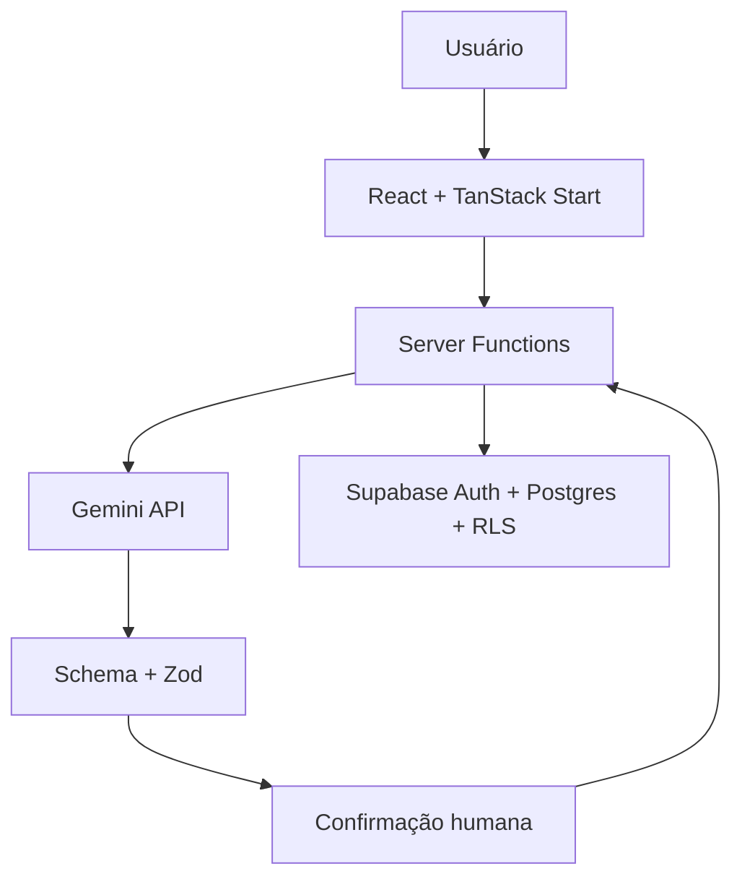

# Finanças no Papo

<div align="center">

### Personal finance, in your own words.
### Finanças pessoais, do jeito que você fala.

Um MVP de controle financeiro conversacional, acessível e seguro, desenvolvido como projeto de estudo em produto, inteligência artificial e vibe coding.

A conversational, accessible and secure personal finance MVP built as a hands-on study in product development, artificial intelligence and vibe coding.


</div>

---

## 🇧🇷 Sobre o projeto

O **Finanças no Papo** é uma aplicação web para pessoas que querem organizar receitas, despesas e metas sem depender de planilhas ou formulários complexos.

Sua principal experiência é um chat em português brasileiro. O usuário escreve uma movimentação como “gastei R$ 42,90 no mercado ontem”, a inteligência artificial interpreta os dados e o sistema apresenta um rascunho para revisão. A transação só é gravada depois da confirmação humana.

Para ampliar o acesso, o chat não é a única alternativa. Todas as movimentações também podem ser registradas, editadas e excluídas por uma interface estruturada.

O projeto foi orientado por princípios de **Design Universal**, buscando atender pessoas com diferentes níveis de familiaridade tecnológica, conhecimento financeiro, dispositivos e formas de interação.

> Este é um projeto educacional e de portfólio. Ele não substitui aconselhamento financeiro profissional.


## 🇺🇸 About the project

**Finanças no Papo** is a personal finance web application designed for people who want to manage income, expenses and savings goals without relying on spreadsheets or complicated forms.

Its primary experience is a Brazilian Portuguese chat. The user writes a sentence such as “I spent R$ 42.90 at the market yesterday”, the AI extracts the transaction data, and the application presents a draft for review. Nothing is stored before explicit human confirmation.

A structured interface is also available, making the core experience usable without depending exclusively on conversational AI.

The project follows **Universal Design** principles and explores how AI-assisted development can accelerate an MVP while still requiring human review, testing and technical ownership.

---

## ✨ Funcionalidades

- Registro de receitas e despesas em linguagem natural;
- interpretação de mensagens em português brasileiro, incluindo gírias e erros de digitação;
- perguntas de acompanhamento quando faltam valor, data, descrição ou tipo;
- saída estruturada da IA e validação adicional com Zod;
- confirmação humana obrigatória antes de salvar uma sugestão;
- cadastro manual como alternativa completa ao chat;
- criação, edição, busca, filtragem e exclusão de transações;
- dashboard mensal com receitas, despesas, saldo e categoria de maior gasto;
- criação e acompanhamento de metas financeiras;
- relatórios por período e categoria;
- visualização dos relatórios em gráfico textual ou tabela;
- autenticação por e-mail e senha;
- login com Google, quando o provedor está configurado;
- isolamento dos dados de cada usuário com Row Level Security;
- estados de carregamento, erro, vazio e confirmação;
- layout responsivo para computador e celular.

---

## 🧭 Jornada de desenvolvimento e reflexão

O projeto nasceu a partir da elaboração de um PRD, com definição do problema, público-alvo, escopo do MVP, critérios de aceitação e requisitos de Design Universal.

O **Lovable** foi utilizado para transformar esse documento em um primeiro MVP visual e funcional. A ferramenta acelerou a criação das telas e da estrutura inicial, mas a experiência de desenvolvimento foi mista.

O fluxo gerado inicialmente exigia confirmação de e-mail. Isso deixou a conta de teste presa no estado de confirmação pendente e impediu o acesso normal à aplicação. Uma parte considerável dos créditos e prompts disponíveis foi consumida tentando remover ou contornar essa autenticação, sem que o problema fosse resolvido de forma confiável. Também foram necessários novos prompts para fazer uma validação manual dentro do próprio Lovable.

Com o orçamento de iterações reduzido, o acabamento técnico passou para o **ChatGPT/Codex**, utilizado para revisar e estabilizar o projeto. Essa etapa incluiu ajustes na autenticação, organização das funções de servidor, proteção das operações financeiras, validação das respostas da IA, tratamento de erros, testes e refinamento da experiência final.

### Principais aprendizados

- Ferramentas de vibe coding são muito eficientes para prototipação e scaffolding;
- autenticação e serviços externos dependem tanto do código quanto da configuração do provedor;
- repetir prompts nem sempre resolve problemas de infraestrutura ou estado;
- cálculos financeiros não devem ser delegados a um modelo de linguagem;
- respostas da IA precisam de schema, normalização e validação;
- operações sugeridas pela IA devem permanecer sob controle do usuário;
- acessibilidade precisa fazer parte do projeto desde o PRD;
- uma ferramenta de IA acelera o trabalho, mas não substitui entendimento técnico, testes e revisão humana.

### Development reflection

Lovable successfully accelerated the first visual and functional MVP, but the authentication flow introduced an unexpected email-confirmation blocker. Several prompt credits were spent trying to remove or work around that state without a reliable result.

ChatGPT/Codex was then used for the final technical review, debugging, validation, security hardening, tests and product polish. The experience reinforced an important lesson: AI development tools are excellent accelerators, but production-sensitive areas such as identity, data access and external services still require technical understanding and deliberate verification.

---

## 🧠 Regra central da arquitetura

> **A IA interpreta. O sistema valida, calcula e armazena. O usuário decide.**

A API Gemini não escreve diretamente no banco de dados. Ela recebe a mensagem, devolve uma estrutura controlada e passa pelas seguintes camadas:

1. Schema de resposta estruturada da API;
2. validação e normalização com Zod;
3. validação das regras de negócio;
4. apresentação do rascunho na interface;
5. confirmação explícita do usuário;
6. gravação por uma função de servidor autenticada.



Os totais de receitas, despesas, saldos e percentuais são calculados pelo código da aplicação. O modelo de linguagem é usado somente para interpretar a conversa e redigir respostas curtas.

---

## 🛠️ Tecnologias utilizadas

| Área | Tecnologia | Uso no projeto |
|---|---|---|
| Interface | React 19 | Componentes e experiência de usuário |
| Full stack | TanStack Start | Rotas, server functions e estrutura da aplicação |
| Navegação | TanStack Router | Rotas tipadas e áreas autenticadas |
| Dados assíncronos | TanStack Query | Cache, consultas e invalidação |
| Linguagem | TypeScript | Tipagem estática e segurança durante o desenvolvimento |
| Estilos | Tailwind CSS 4 | Design responsivo e sistema visual |
| Componentes | Radix UI | Primitivos acessíveis de interface |
| Validação | Zod | Schemas e validação de entradas e respostas |
| Banco de dados | Supabase Postgres | Persistência de transações e metas |
| Autenticação | Supabase Auth | Sessão, e-mail/senha e OAuth com Google |
| Segurança dos dados | Supabase RLS | Isolamento dos registros por usuário |
| Inteligência artificial | Gemini API | Extração estruturada de transações |
| Build | Vite | Ambiente de desenvolvimento e build |
| Feedback visual | Sonner | Mensagens de sucesso e erro |
| Ícones | Lucide React | Iconografia da interface |
| Qualidade | ESLint, Prettier e Node Test Runner | Padronização e testes automatizados |

---

## ♿ Design Universal e acessibilidade

A interface foi construída para reduzir barreiras e não depender de uma única forma de interação.

Entre as decisões implementadas estão:

- idioma principal declarado como português brasileiro;
- link para pular diretamente ao conteúdo;
- navegação possível por teclado;
- foco visível nos elementos interativos;
- HTML semântico e rótulos associados aos campos;
- textos auxiliares para leitores de tela;
- receitas e despesas identificadas por texto, sinal, ícone e cor;
- respeito à preferência de redução de movimento;
- mensagens de erro com orientação de recuperação;
- alternativa estruturada ao registro pelo chat;
- relatórios disponíveis em formato textual e tabular;
- navegação adaptada para telas pequenas;
- linguagem simples e sem julgamento sobre hábitos financeiros.

O projeto busca práticas alinhadas à WCAG e aos princípios de Design Universal, mas ainda não passou por uma auditoria formal de conformidade.

---

## 🔐 Segurança e privacidade

- A chave da API Gemini permanece somente no servidor;
- variáveis iniciadas por `VITE_` nunca devem receber credenciais privadas;
- funções financeiras exigem uma sessão válida;
- consultas e mutações são limitadas ao usuário autenticado;
- tabelas públicas utilizam RLS e políticas de propriedade;
- IDs, valores, datas, categorias e descrições passam por validação;
- datas impossíveis e estruturas inesperadas da IA são rejeitadas;
- respostas completas de serviços externos não são expostas na interface;
- há tratamento para timeout, limite de requisições e falhas de autenticação da IA.

---

## 📁 Estrutura principal

```text
FinancasNoPapo/
├── src/
│   ├── integrations/supabase/   # Cliente, tipos e autenticação
│   ├── lib/                     # Regras financeiras e funções de servidor
│   ├── routes/                  # Landing page, autenticação e área privada
│   ├── routeTree.gen.ts         # Árvore de rotas gerada pelo TanStack
│   └── styles.css               # Design system e estilos globais
├── supabase/
│   └── migrations/              # Estrutura do banco, RLS e políticas
├── tests/                       # Testes do interpretador de transações
├── .env.example                 # Modelo das variáveis de ambiente
└── package.json
```

---

## 📸 Prévia

As capturas da versão mais recente estão sendo preparadas.

<!--
Quando os arquivos estiverem no repositório, substitua este comentário por:

| Dashboard | Chat |
|---|---|
|  |  |

| Transações | Relatórios |
|---|---|
|  |  |
-->

Arquivos sugeridos:

```text
docs/screenshots/
├── landing-page.png
├── dashboard.png
├── chat.png
├── transacoes.png
├── metas.png
└── relatorios.png
```

---

## 🚀 Executando localmente

### Pré-requisitos

- Node.js 22 ou superior;
- npm;
- um projeto Supabase;
- uma chave da API Gemini.

### 1. Clone o repositório

```bash
git clone https://github.com/yruamkaffer/FinancasNoPapo.git
cd FinancasNoPapo
```

### 2. Instale as dependências

```bash
npm ci
```

### 3. Crie o arquivo de ambiente

Linux ou macOS:

```bash
cp .env.example .env
```

Windows PowerShell:

```powershell
Copy-Item .env.example .env
```

### 4. Configure as variáveis

```env
VITE_SUPABASE_URL=https://SEU-PROJETO.supabase.co
VITE_SUPABASE_PUBLISHABLE_KEY=sb_publishable_SUBSTITUA

SUPABASE_URL=https://SEU-PROJETO.supabase.co
SUPABASE_PUBLISHABLE_KEY=sb_publishable_SUBSTITUA

GEMINI_API_KEY=SUBSTITUA
GEMINI_MODEL=gemini-2.5-flash
```

Nunca utilize uma chave `service_role` ou `sb_secret_` em uma variável iniciada por `VITE_`.

### 5. Prepare o Supabase

Aplique as migrations disponíveis em `supabase/migrations` ao seu projeto Supabase.

Configure no Supabase Auth:

- autenticação por e-mail e senha;
- exigência ou não de confirmação de e-mail, conforme o fluxo desejado;
- Google OAuth, caso queira disponibilizar esse login;
- URLs permitidas de redirecionamento.

Para um ambiente de demonstração com acesso imediato, a confirmação de e-mail pode ser desativada conscientemente no provedor. Em um ambiente real, avalie o impacto de segurança antes de tomar essa decisão.

### 6. Inicie a aplicação

```bash
npm run dev
```

---

## ✅ Qualidade e validação

```bash
npm run lint
npm run typecheck
npm test
npm run build
```

Os testes atuais cobrem pontos críticos da interpretação financeira, como:

- combinação de respostas curtas com um rascunho anterior;
- rejeição de datas impossíveis;
- normalização de categorias;
- rejeição de estruturas inesperadas retornadas pela IA.

---

## 📌 Status e próximos passos

O projeto está em estado de **MVP funcional**.

Próximas evoluções consideradas:

- adicionar recuperação de senha;
- ampliar a cobertura de testes;
- criar testes end-to-end dos fluxos principais;
- executar uma auditoria formal de acessibilidade;
- adicionar orçamentos mensais por categoria;
- permitir transações recorrentes;
- exportar relatórios em CSV ou PDF;
- adicionar as capturas da versão final;
- disponibilizar uma demonstração pública controlada.

---

## 🤖 Autoria e uso de inteligência artificial

**Concepção, decisões de produto, PRD, testes e direção do projeto:** [Yruam Käffer](https://github.com/yruamkaffer)

Ferramentas utilizadas durante o desenvolvimento:

- **Lovable:** geração do primeiro MVP e da base visual;
- **ChatGPT:** apoio na definição do produto, PRD e refinamento dos requisitos;
- **Codex:** revisão técnica, correções, estabilização, validações, testes e acabamento final.

A inteligência artificial foi utilizada como ferramenta de desenvolvimento. As decisões de produto, critérios, testes e direcionamento permaneceram sob responsabilidade do autor.

---

<div align="center">

Feito para aprender, experimentar e transformar finanças pessoais em uma conversa mais simples.

**Built to learn, experiment and turn personal finance into a simpler conversation.**

</div>
